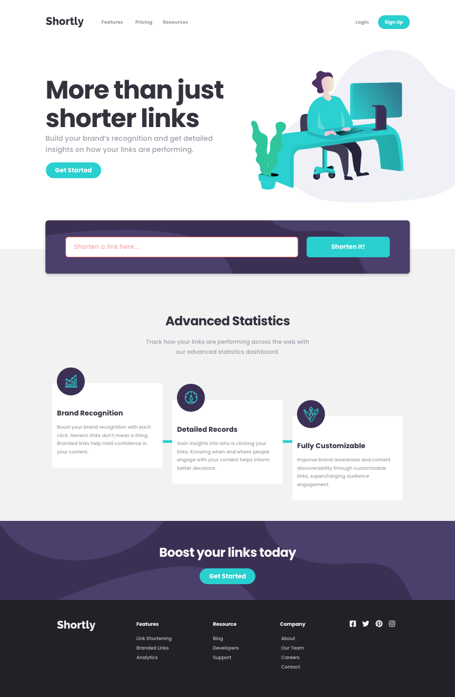

# Frontend Mentor - Shortly URL shortening API Challenge solution

This is a solution to the [Shortly URL shortening API Challenge challenge on Frontend Mentor](https://www.frontendmentor.io/challenges/url-shortening-api-landing-page-2ce3ob-G). Frontend Mentor challenges help you improve your coding skills by building realistic projects. 

## Table of contents

- [Overview](#overview)
  - [The challenge](#the-challenge)
  - [Screenshot](#screenshot)
  - [Links](#links)
- [My process](#my-process)
  - [Built with](#built-with)
  - [What I learned](#what-i-learned)
  - [Continued development](#continued-development)
  - [Useful resources](#useful-resources)
- [Author](#author)
- [Acknowledgments](#acknowledgments)

## Overview

### The challenge

Users should be able to:

- View the optimal layout for the site depending on their device's screen size
- Shorten any valid URL
- See a list of their shortened links, even after refreshing the browser
- Copy the shortened link to their clipboard in a single click
- Receive an error message when the `form` is submitted if:
  - The `input` field is empty
  - The URL must begin with `http://` or `https://`
  - They attempt to submit the same URL more than once (if the original URL is still saved in `localStorage`)
  - The form should also handle any errors returned by the API.

### Screenshot

### Links

- Solution URL: [Shortly: URL Shortener using React/Typescript/HTML/CSS](https://www.frontendmentor.io/solutions/shortly-url-shortener-using-reacttypescripthtmlcss-S1E_AhdIq)
- Live Site URL: [Shortly: URL Shortener (Hosted @ Vercel)](https://shortly-react-ts.vercel.app/)

## My process

I would begin working on the desktop layout, utilizing the Figma document for colors and general sizing. I tried not to use pixel widths, and preferred to use `vh/vw` or `%` since that seemed to make the Responsive design easier to implement.

I would try to do one section at a time -- first Desktop design, then Mobile design. I still find CSS very tedious, but it's a fun departure from coding.

The most amount of time was spent on implementing the API calls and form validation. This also proved to be a bit tedious as I'm new to React and its REST libraries.

### Built with

- Semantic HTML5 markup
- CSS custom properties
- Flexbox
- Responsive Design
- [React](https://reactjs.org/) - JS library

### What I learned

I think I enjoy React more than Angular :)

### Continued development

- I would like to work on understanding the best practices around React, and breakdown my Components into smaller chunks -- especially API/service calls, and Forms/validation.
- Would also like to improve my CSS development, and use a post-processor like SASS or Less to make it smaller and more readable.
### Useful resources

- [React Hook Form](https://react-hook-form.com/) - React Hook for Form Validation. Also was able to integrate error messages from API calls.
- [Scrolling to last element added to page](https://stackoverflow.com/questions/43441856/how-to-scroll-to-an-element) - I wanted to add a feature where the user would be shown the result of their URL Shortener request. Using this code I was able to scroll the page down to the most recent "card" result.

## Author

- Website - [Chris Serra](https://github.com/cbserra)
- Frontend Mentor - [@yourusername](https://www.frontendmentor.io/profile/cbserra)
- Twitter - [@yourusername](https://www.twitter.com/bearserra)

## Acknowledgments

Thanks to Google and Stack Overflow :D
